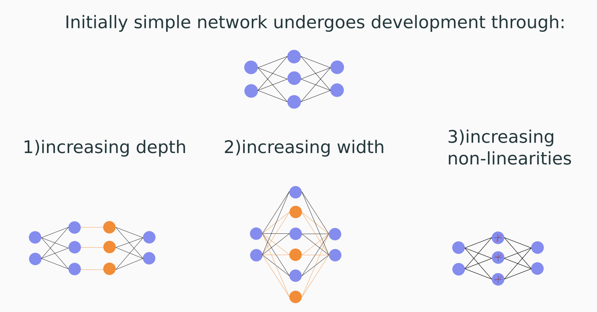

# Developmental Network
Artificial Neural Network that grows in complexity during training. This is achieved by:
<ul>
  <li> increasing the depth of the network </li>
  <li> increasing the width of the layers </li>
  <li> increasing the nonlinearities of the neurons </li>
<ul>



## Experiments

Experiments can be run for MNIST, CIFAR10 and a student-teacher dataset directly via the scripts [run_mnist.py](run_mnist.py), [run_cifar10.py](run_cifar10.py). More detailed experiments and pipelines can be run from the [experiments](experiments) folder.

## Related work

During the development of this project, we found a very related article.

```
@article{Chen2015Nov,
  author = {Chen, Tianqi and Goodfellow, Ian and Shlens, Jonathon},
  title = {{Net2Net: Accelerating Learning via Knowledge Transfer}},
  journal = {arXiv},
  year = {2015},
  month = nov,
  eprint = {1511.05641},
  doi = {10.48550/arXiv.1511.05641}
}
```